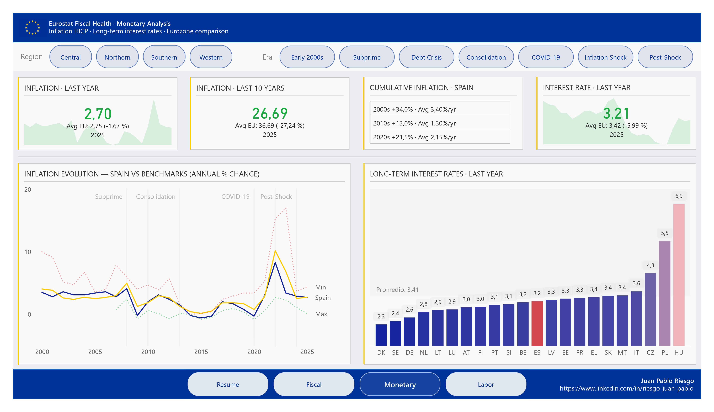
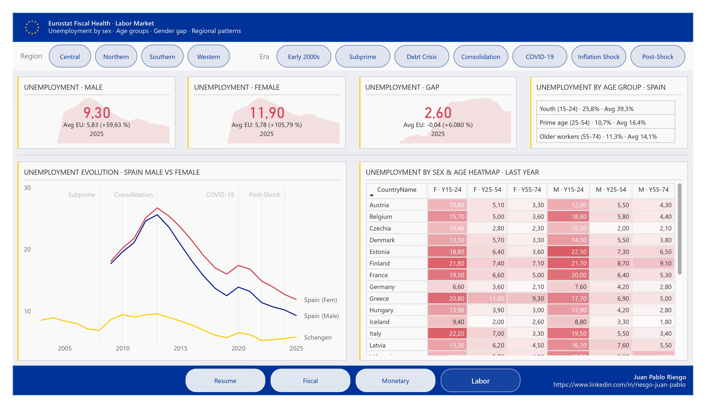

# Results

Findings and answers to the research questions defined in [README.md](README.md).

Data covers 25 Schengen Area countries from 2000 to the most recent available year. All fiscal indicators are expressed as % of GDP. Unemployment as % of active population. Inflation as annual % change (HICP).

> **Note:** Switzerland, Norway, and Iceland are Schengen members but not EU members. Eurostat coverage for government debt, deficit, and some expenditure categories is limited or unavailable for these countries. NULL values reflect missing source data, not zero values.

---

## 1. How has public debt evolved across the Schengen Area?

Public debt increased significantly across the Schengen Area over the observation period, driven by three major shocks: the Global Financial Crisis (2008–2009), the Eurozone Debt Crisis (2010–2012), and the COVID-19 pandemic (2020–2021).

Southern European countries carry the heaviest debt burdens. Greece peaked at 209.4% of GDP in 2020, followed by Italy (154.4%) and Portugal (134.1%). France and Spain also crossed the 100% threshold. By contrast, Estonia, Luxembourg, and Denmark maintained debt well below 50% throughout the period.

The 2020s decade shows a mixed picture: most countries stabilized or slightly reduced debt after the COVID peak, but levels remain structurally higher than pre-2008 averages in nearly all cases.

| Country | Last Year | Avg 2000s | Avg 2010s | Avg 2020s | Lowest Year | Lowest Value | Highest Year | Highest Value |
|---|---|---|---|---|---|---|---|---|
| Austria | 79.9 | 68.72 | 81.13 | 80.28 | 2007 | 65.8 | 2015 | 85.6 |
| Belgium | 103.9 | 99.01 | 103.12 | 105.96 | 2007 | 87.5 | 2020 | 111.4 |
| Czechia | 43.3 | 26.58 | 37.63 | 41.12 | 2000 | 16.9 | 2013 | 44.1 |
| Denmark | 30.5 | 42.9 | 44.46 | 36.32 | 2007 | 29.5 | 2000 | 53.6 |
| Estonia | 23.5 | 5.25 | 9.76 | 20.08 | 2007 | 3.9 | 2024 | 23.5 |
| Finland | 82.5 | 41.83 | 62.03 | 76.4 | 2008 | 34.7 | 2024 | 82.5 |
| France | 113.2 | 66.56 | 94.81 | 112.42 | 2001 | 59.3 | 2020 | 114.9 |
| Germany | 62.2 | 64.02 | 71.43 | 64.96 | 2001 | 58.1 | 2010 | 81.0 |
| Greece | 154.2 | 109.63 | 176.71 | 180.6 | 2003 | 104.3 | 2020 | 209.4 |
| Hungary | 73.5 | 62.12 | 74.89 | 75.14 | 2001 | 52.2 | 2011 | 80.5 |
| Italy | 134.9 | 107.08 | 130.13 | 141.48 | 2007 | 103.5 | 2020 | 154.4 |
| Latvia | 46.6 | 15.93 | 42.06 | 45.06 | 2007 | 8.9 | 2010 | 48.6 |
| Lithuania | 38.0 | 20.08 | 38.38 | 40.52 | 2008 | 14.6 | 2020 | 45.9 |
| Luxembourg | 26.3 | 9.19 | 20.84 | 24.92 | 2002 | 7.4 | 2024 | 26.3 |
| Malta | 46.2 | 65.41 | 55.95 | 48.42 | 2019 | 39.3 | 2004 | 71.2 |
| Netherlands | 43.7 | 49.86 | 60.02 | 48.36 | 2007 | 42.8 | 2013 | 67.2 |
| Poland | 55.1 | 44.05 | 52.0 | 52.6 | 2000 | 36.2 | 2013 | 56.9 |
| Portugal | 93.6 | 68.43 | 123.12 | 111.94 | 2000 | 54.2 | 2020 | 134.1 |
| Slovakia | 59.7 | 39.51 | 49.61 | 58.38 | 2008 | 28.6 | 2021 | 60.2 |
| Slovenia | 66.6 | 26.67 | 66.61 | 72.54 | 2008 | 21.9 | 2015 | 83.4 |
| Spain | 101.6 | 46.59 | 92.7 | 110.22 | 2007 | 35.7 | 2020 | 119.3 |
| Sweden | 34.0 | 46.19 | 40.8 | 35.54 | 2023 | 32.0 | 2001 | 52.0 |

---

## 2. Which countries consolidated their finances after the Eurozone debt crisis — and which did not?

Fiscal consolidation during 2013–2019 was uneven. Countries under market pressure — Greece, Portugal, Spain, Ireland — implemented the most aggressive adjustments, driven by EU/IMF conditionality. Greece reduced its deficit from -15.4% (2009) to a surplus of +1.2% (2024), the most dramatic turnaround in the dataset. Portugal went from -11.4% (2010) to +1.3% (2023).

Northern and Central European countries — Germany, Netherlands, Sweden, Denmark — maintained broadly balanced budgets throughout the 2010s, with Germany achieving a sustained surplus between 2014 and 2019.

France and Italy consolidated less aggressively and entered the COVID shock with structural deficits still above 3% of GDP.

| Country | Last Year | Avg 2000s | Avg 2010s | Avg 2020s | Best Year | Best Value | Worst Year | Worst Value |
|---|---|---|---|---|---|---|---|---|
| Austria | -4.7 | -2.48 | -1.52 | -4.92 | 2019 | 0.5 | 2020 | -8.2 |
| Belgium | -4.4 | -1.09 | -2.79 | -5.28 | 2006 | 0.2 | 2020 | -9.0 |
| Czechia | -2.0 | -3.84 | -1.14 | -3.88 | 2017 | 1.5 | 2003 | -6.9 |
| Denmark | 4.5 | 2.21 | -0.08 | 3.16 | 2007 | 5.3 | 2012 | -3.2 |
| Estonia | -1.7 | 0.62 | -0.06 | -2.66 | 2006 | 2.8 | 2020 | -5.4 |
| Finland | -4.4 | 3.41 | -1.78 | -3.14 | 2000 | 6.9 | 2020 | -5.5 |
| France | -5.8 | -3.37 | -4.3 | -6.28 | 2000 | -1.3 | 2020 | -8.9 |
| Germany | -2.7 | -2.46 | 0.2 | -2.94 | 2018 | 1.9 | 2020 | -4.4 |
| Greece | 1.2 | -7.79 | -5.19 | -3.92 | 2024 | 1.2 | 2009 | -15.4 |
| Hungary | -5.0 | -6.04 | -2.76 | -6.52 | 2016 | -1.8 | 2006 | -9.3 |
| Italy | -3.4 | -3.19 | -2.75 | -7.4 | 2007 | -1.3 | 2020 | -9.4 |
| Latvia | -1.8 | -2.6 | -2.12 | -4.08 | 2016 | 0.0 | 2009 | -9.8 |
| Lithuania | -1.3 | -2.49 | -1.99 | -2.04 | 2018 | 0.5 | 2009 | -9.1 |
| Luxembourg | 0.9 | 2.13 | 1.35 | -0.32 | 2001 | 5.6 | 2020 | -3.1 |
| Malta | -3.5 | -4.48 | -0.59 | -5.78 | 2017 | 3.4 | 2003 | -9.0 |
| Netherlands | -0.9 | -1.25 | -1.54 | -1.46 | 2019 | 1.9 | 2010 | -5.3 |
| Poland | -6.5 | -4.46 | -3.15 | -4.74 | 2018 | -0.2 | 2010 | -7.4 |
| Portugal | 0.5 | -5.0 | -4.76 | -1.42 | 2023 | 1.3 | 2010 | -11.4 |
| Slovakia | -5.5 | -5.3 | -3.09 | -4.56 | 2018 | -1.0 | 2000 | -12.7 |
| Slovenia | -0.9 | -2.57 | -3.53 | -3.76 | 2018 | 0.9 | 2013 | -11.2 |
| Spain | -3.2 | -1.31 | -6.25 | -5.54 | 2006 | 2.1 | 2012 | -11.5 |
| Sweden | -1.6 | 1.06 | -0.24 | -0.98 | 2007 | 3.4 | 2020 | -3.2 |

---

## 3. How did the composition of public expenditure change after COVID-19 and the 2022 inflation shock?

Defence expenditure increased notably in Eastern and Baltic countries after 2022. Estonia leads the dataset at 3.7% of GDP, followed by Lithuania (2.6%) and Latvia — though Latvia's data is missing for the most recent year. Nordic countries Sweden (2.2%) and Norway (2.1%) also show elevated defence spending.

Social protection remains the largest spending category across the region, ranging from 12.3% (Hungary) to 26.5% (Finland). Health and education spending are broadly consistent across countries, with Northern European nations generally above the regional average.

Germany, France, Latvia, and Poland show NULL values for several expenditure categories in the most recent year — this reflects incomplete Eurostat reporting at COFOG level, not zero spending.

| Country | Debt | Deficit | Defence | Econ. Affairs | Education | Health | Housing | Social Prot. |
|---|---|---|---|---|---|---|---|---|
| Austria | 79.9 | -4.7 | 0.7 | 7.1 | 5.3 | 9.5 | 0.4 | 22.8 |
| Belgium | 103.9 | -4.4 | 1.3 | 6.4 | 6.3 | 8.0 | 0.4 | 20.4 |
| Czechia | 43.3 | -2.0 | 1.3 | 5.5 | 4.5 | 9.0 | 0.9 | 13.2 |
| Denmark | 30.5 | 4.5 | 1.8 | 3.1 | 5.6 | 8.3 | 0.3 | 19.6 |
| Estonia | 23.5 | -1.7 | 3.7 | 4.6 | 6.3 | 6.3 | 0.4 | 13.8 |
| Finland | 82.5 | -4.4 | 1.5 | 4.9 | 6.3 | 7.7 | 0.5 | 26.5 |
| Greece | 154.2 | 1.2 | 2.2 | 6.0 | 3.9 | 5.7 | 0.5 | 17.7 |
| Hungary | 73.5 | -5.0 | 2.0 | 7.7 | 4.9 | 4.7 | 1.0 | 12.3 |
| Italy | 134.9 | -3.4 | 1.3 | 5.1 | 4.0 | 6.6 | 0.8 | 21.3 |
| Lithuania | 38.0 | -1.3 | 2.6 | 3.2 | 5.5 | 5.8 | 0.8 | 14.7 |
| Luxembourg | 26.3 | 0.9 | 0.7 | 5.9 | 5.0 | 5.6 | 0.6 | 19.9 |
| Malta | 46.2 | -3.5 | 0.5 | 7.6 | 4.7 | 5.0 | 0.6 | 9.8 |
| Netherlands | 43.7 | -0.9 | 1.6 | 4.4 | 5.1 | 7.3 | 0.6 | 16.6 |
| Norway | — | — | 2.1 | 5.7 | 4.7 | 7.2 | 0.9 | 18.5 |
| Portugal | 93.6 | 0.5 | 0.9 | 3.7 | 4.3 | 6.8 | 0.6 | 17.1 |
| Slovakia | 59.7 | -5.5 | — | — | — | — | — | — |
| Slovenia | 66.6 | -0.9 | 1.4 | 5.7 | 5.5 | 8.0 | 0.4 | 17.1 |
| Spain | 101.6 | -3.2 | 0.9 | 5.1 | 4.1 | 6.5 | 0.5 | 18.7 |
| Sweden | 34.0 | -1.6 | 2.2 | 4.8 | 7.2 | 7.4 | 0.8 | 19.1 |
| Switzerland | — | — | 0.8 | 3.8 | 5.3 | 2.2 | 0.2 | 12.7 |

---

## 4. What regional patterns emerge in public expenditure across the different economic eras?

Northern Europe consistently shows lower debt, tighter fiscal positions, and higher social spending as a share of GDP. Finland is a notable exception with rapidly growing debt in the 2020s (76.4% average), driven by structural reforms and COVID spending.

Southern Europe shows the highest debt accumulation and the slowest consolidation path. Greece, Italy, and Portugal form a distinct cluster — high debt, high interest burden historically, and constrained fiscal space.

Central Europe (Czechia, Hungary, Slovakia, Poland) entered the period with lower debt and moderate deficits, but showed higher inflation sensitivity during the 2022 shock, with Hungary (17%) and Czechia (14.8%) reaching the highest peaks in the dataset.

Western Europe (France, Belgium, Netherlands, Luxembourg) presents a mixed picture — Belgium and France carry structural debt above 100% GDP, while the Netherlands and Luxembourg maintain much healthier positions.

---

## 5. How have inflation and long-term interest rates evolved across the Schengen Area?

The 2022 inflation shock was the dominant monetary event of the observation period. All countries experienced peak inflation in 2022, with Estonia (19.4%), Lithuania (18.9%), Latvia (17.2%), and Hungary (17%) recording the highest values. Western European countries were less affected — France (5.9%), Switzerland (2.7%).

Cumulative inflation over the 2010s was generally low — most countries accumulated 12–20% over the decade, reflecting the post-crisis disinflationary environment and ECB policy. The 2020s decade is already showing higher cumulative inflation despite covering fewer years, with Hungary (58.9%), Estonia (47.1%), and Poland (46.4%) leading.

Switzerland stands out with near-zero cumulative inflation across all decades — a structural feature of its monetary independence and CHF appreciation.

Long-term interest rates converged significantly after 2010 within the eurozone, reflecting ECB policy. Non-eurozone countries (Hungary: 4.54% avg, Poland: 3.84%) maintained higher rates throughout.

| Country | Last Year | Avg 2000s | Cum. 2000s | Avg 2010s | Cum. 2010s | Avg 2020s | Cum. 2020s | Lowest Year | Lowest | Highest Year | Highest |
|---|---|---|---|---|---|---|---|---|---|---|---|
| Austria | 3.6 | 1.89 | 20.56 | 1.91 | 20.79 | 4.5 | 29.97 | 2009 | 0.4 | 2022 | 8.6 |
| Belgium | 3.0 | 2.11 | 23.15 | 1.82 | 19.72 | 3.92 | 25.6 | 2009 | 0.0 | 2022 | 10.3 |
| Czechia | 2.3 | 2.57 | 28.68 | 1.67 | 17.96 | 6.4 | 44.15 | 2003 | -0.1 | 2022 | 14.8 |
| Denmark | 1.8 | 2.03 | 22.23 | 1.08 | 11.29 | 2.88 | 18.35 | 2016 | 0.0 | 2022 | 8.6 |
| Estonia | 4.8 | 4.35 | 52.56 | 2.6 | 29.11 | 6.82 | 47.05 | 2020 | -0.6 | 2022 | 19.4 |
| Finland | 1.8 | 1.83 | 19.82 | 1.49 | 15.87 | 2.8 | 17.84 | 2015 | -0.2 | 2022 | 7.2 |
| France | 0.9 | 1.87 | 20.32 | 1.28 | 13.53 | 2.9 | 18.56 | 2015 | 0.1 | 2022 | 5.9 |
| Germany | 2.3 | 1.65 | 17.75 | 1.42 | 15.12 | 3.85 | 25.18 | 2009 | 0.2 | 2022 | 8.7 |
| Greece | 2.9 | 3.22 | 37.25 | 0.78 | 7.91 | 3.12 | 19.85 | 2014 | -1.4 | 2022 | 9.3 |
| Hungary | 4.4 | 6.12 | 80.75 | 2.52 | 28.04 | 8.17 | 58.87 | 2014 | 0.0 | 2023 | 17.0 |
| Iceland | 3.7 | — | — | 1.35 | 2.71 | 4.47 | 29.82 | 2018 | 0.7 | 2023 | 8.0 |
| Italy | 1.6 | 2.33 | 25.88 | 1.26 | 13.28 | 3.18 | 20.37 | 2020 | -0.2 | 2022 | 8.7 |
| Latvia | 3.8 | 5.84 | 75.17 | 1.45 | 15.34 | 5.78 | 38.89 | 2010 | -1.2 | 2022 | 17.2 |
| Lithuania | 3.4 | 3.06 | 34.5 | 1.83 | 19.75 | 6.27 | 42.6 | 2003 | -1.1 | 2022 | 18.9 |
| Luxembourg | 2.5 | 2.76 | 31.21 | 1.77 | 19.1 | 3.23 | 20.83 | 2020 | 0.0 | 2022 | 8.2 |
| Malta | 2.4 | 2.5 | 27.95 | 1.61 | 17.29 | 3.0 | 19.25 | 2021 | 0.7 | 2022 | 6.1 |
| Netherlands | 3.0 | 2.28 | 25.2 | 1.5 | 15.99 | 4.3 | 28.34 | 2016 | 0.1 | 2022 | 11.6 |
| Norway | 2.8 | 1.73 | 14.62 | 2.09 | 22.93 | 3.77 | 24.73 | 2012 | 0.4 | 2022 | 6.2 |
| Poland | 3.3 | 3.59 | 41.87 | 1.53 | 16.27 | 6.63 | 46.43 | 2015 | -0.7 | 2022 | 13.2 |
| Portugal | 2.2 | 2.58 | 28.9 | 1.22 | 12.82 | 3.18 | 20.43 | 2009 | -0.9 | 2022 | 8.1 |
| Slovakia | 4.2 | 5.26 | 66.16 | 1.58 | 16.83 | 5.88 | 40.3 | 2016 | -0.5 | 2000 | 12.2 |
| Slovenia | 2.5 | 4.95 | 61.61 | 1.35 | 14.28 | 3.78 | 24.58 | 2015 | -0.8 | 2022 | 9.3 |
| Spain | 2.7 | 2.98 | 34.05 | 1.24 | 13.04 | 3.33 | 21.53 | 2015 | -0.6 | 2022 | 8.3 |
| Sweden | 2.6 | 1.84 | 19.97 | 1.22 | 12.87 | 3.67 | 23.9 | 2014 | 0.2 | 2022 | 8.1 |
| Switzerland | 0.1 | 0.83 | 2.5 | 0.07 | 0.69 | 0.98 | 6.0 | 2020 | -0.8 | 2022 | 2.7 |

---

## 6. What differences can be observed between countries inside and outside the eurozone?

Eurozone members showed tighter inflation convergence during the 2010s, reflecting common ECB monetary policy. However, the 2022 shock exposed significant divergence — smaller, more open eurozone economies (Estonia, Latvia, Lithuania, Slovakia) experienced inflation 2–3x higher than larger core economies (France, Germany, Austria).

Non-eurozone countries split into two groups. Switzerland and Norway maintained very low and moderate inflation respectively, with independent monetary policy providing a buffer. Non-eurozone EU members (Hungary, Poland, Czechia, Sweden) experienced high inflation during 2022, comparable to or exceeding the Baltic states, without the ECB framework as anchor.

Long-term interest rates confirm the eurozone convergence story: eurozone members averaged 1.0–1.3% during the 2010s, while Hungary (4.54%) and Poland (3.84%) maintained significantly higher rates reflecting currency and fiscal risk premiums.

---

## 7. How has unemployment by sex evolved across the Schengen Area?

Unemployment peaked across the region during the Global Financial Crisis (2008–2010) and the subsequent Eurozone Debt Crisis. The most severe impacts were in Southern Europe — Spain peaked at 25.6% male and 26.7% female unemployment (2013), Greece at 24.8% male and 31.7% female.

Recovery was sustained through 2019, with most countries reaching historic lows. The COVID-19 shock had a surprisingly limited impact on unemployment in most countries, partly due to short-time work schemes. Post-2022, unemployment has remained near historic lows in Northern and Central Europe.

The gender gap shows a clear geographic pattern. Southern European countries show persistently higher female unemployment — Greece (6.97 pp average gap), Spain (3.23 pp), Italy (1.83 pp). Northern and Central European countries show near-zero or slightly reversed gaps — Latvia (-2.07 pp), Lithuania (-1.63 pp), Estonia (-0.64 pp) show higher male unemployment on average.

| Country | LY Male | Best Male | Best Value | Worst Male | Worst Value | LY Female | Best Female | Best Value | Worst Female | Worst Value | Gender Gap |
|---|---|---|---|---|---|---|---|---|---|---|---|
| Austria | 6.0 | 2022 | 4.9 | 2016 | 7.0 | 5.3 | 2022 | 4.5 | 2021 | 6.1 | -0.62 |
| Belgium | 6.7 | 2022 | 5.8 | 2015 | 9.3 | 5.6 | 2019 | 5.0 | 2010 | 8.6 | -0.54 |
| Czechia | 2.5 | 2019 | 1.7 | 2010 | 6.4 | 3.1 | 2019 | 2.4 | 2010 | 8.5 | 1.42 |
| Denmark | 6.4 | 2022 | 4.4 | 2010 | 8.6 | 6.4 | 2022 | 4.5 | 2012 | 7.8 | 0.12 |
| Estonia | 8.3 | 2019 | 4.1 | 2010 | 19.2 | 6.6 | 2019 | 4.8 | 2010 | 13.9 | -1.44 |
| Finland | 10.2 | 2022 | 7.1 | 2015 | 10.2 | 9.1 | 2019 | 6.2 | 2025 | 9.1 | -1.26 |
| France | 7.8 | 2008 | 7.1 | 2015 | 10.8 | 7.6 | 2022 | 7.1 | 2013 | 10.2 | 0.19 |
| Germany | 4.2 | 2019 | 3.3 | 2009 | 7.7 | 3.5 | 2019 | 2.6 | 2009 | 6.9 | -0.66 |
| Greece | 7.0 | 2025 | 7.0 | 2013 | 24.8 | 11.2 | 2025 | 11.2 | 2013 | 31.7 | 6.86 |
| Hungary | 4.6 | 2019 | 3.3 | 2010 | 11.6 | 4.3 | 2019 | 3.3 | 2011 | 10.2 | -0.35 |
| Iceland | 3.8 | 2018 | 2.8 | 2009 | 8.6 | 3.3 | 2018 | 2.5 | 2010 | 6.7 | -0.62 |
| Italy | 5.7 | 2025 | 5.7 | 2014 | 12.1 | 6.8 | 2025 | 6.8 | 2014 | 13.9 | 1.83 |
| Latvia | 7.7 | 2019 | 7.2 | 2010 | 23.0 | 6.1 | 2019 | 5.4 | 2010 | 16.5 | -2.78 |
| Lithuania | 7.9 | 2022 | 6.5 | 2010 | 21.2 | 5.8 | 2018 | 5.4 | 2010 | 14.5 | -2.69 |
| Luxembourg | 6.2 | 2011 | 3.8 | 2020 | 6.6 | 6.8 | 2022 | 4.7 | 2015 | 7.4 | 0.71 |
| Malta | 3.1 | 2025 | 3.1 | 2010 | 6.7 | 3.0 | 2025 | 3.0 | 2009 | 7.6 | 0.22 |
| Netherlands | 3.8 | 2022 | 3.3 | 2013 | 8.1 | 4.0 | 2023 | 3.8 | 2014 | 8.8 | 0.69 |
| Norway | 4.9 | 2022 | 3.4 | 2016 | 5.5 | 4.1 | 2009 | 3.0 | 2020 | 4.5 | -0.58 |
| Poland | 2.9 | 2024 | 2.7 | 2013 | 10.0 | 3.4 | 2023 | 2.9 | 2013 | 11.4 | 0.54 |
| Portugal | 5.6 | 2025 | 5.6 | 2013 | 17.2 | 6.5 | 2025 | 6.5 | 2013 | 17.3 | 0.46 |
| Slovakia | 5.1 | 2024 | 4.8 | 2010 | 13.9 | 5.8 | 2025 | 5.8 | 2010 | 14.8 | 1.06 |
| Slovenia | 3.6 | 2024 | 3.5 | 2013 | 9.5 | 4.3 | 2023 | 3.7 | 2013 | 10.9 | 0.85 |
| Spain | 9.3 | 2025 | 9.3 | 2013 | 25.6 | 11.9 | 2025 | 11.9 | 2013 | 26.7 | 2.36 |
| Sweden | 8.9 | 2007 | 5.9 | 2025 | 8.9 | 8.8 | 2018 | 6.4 | 2021 | 9.2 | 0.05 |
| Switzerland | 4.9 | 2023 | 3.9 | 2021 | 4.9 | 4.9 | 2023 | 4.3 | 2021 | 5.3 | 0.41 |

---

## Author

**Juan Pablo Riesgo**  
Data Analyst | Madrid, Spain  
[LinkedIn](https://www.linkedin.com/in/riesgo-juan-pablo/)

---

*Last updated: <!-- LAST_UPDATED -->. Data source: [Eurostat](https://ec.europa.eu/eurostat/web/main/data/web-services).*
